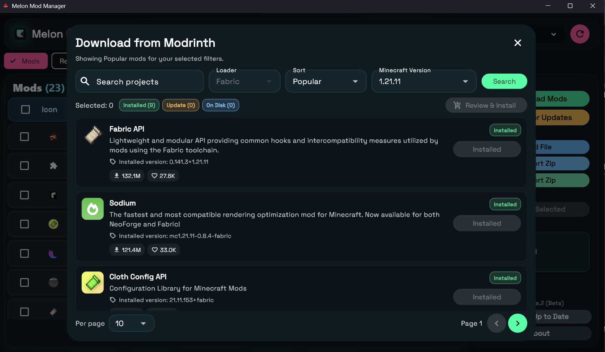

#  Melon Mod Manager

A simple Windows desktop app to manage your Minecraft mods, shaders, and resource packs all in one place. No more hunting through folders or manually checking for updates!

## App Preview



## What Does This App Do?

**Melon Mod Manager** makes it easy to:
- **Browse & Download** mods, shaders, and resource packs directly from Modrinth
- **Update Everything** with one click - no need to check each mod individually
- **Auto-Detect** your Minecraft installation and loader type
- **Drag & Drop** files to quickly add new content
- **Manage All Your Content** - view, organize, and delete unwanted items
- **Import/Export** mod packs to share with friends or backup your setup

Think of it as a one-stop shop for keeping your Minecraft mods organized and up-to-date!

## Compatible Devices

- **Operating System:** Windows 10/11 (64-bit)
- **Minecraft Loaders:** Fabric, Quilt, Forge, NeoForge
- **Internet Required:** Yes (for downloading and checking updates from Modrinth)

## What's New in Beta 4

- ⚡ Startup optimization: metadata warm-up now runs only when needed (first launch / app update), reducing repeated load overhead.
- 🧠 Silent external file detection: externally added mods, shaders, and resource packs are matched in the background and auto-linked to Modrinth when possible.
- 🛡️ Safer update/install flow: staged commit order prevents old-file cleanup from happening before new files are safely written.
- ✅ Download integrity checks: Modrinth file hash verification added before install.
- 🧹 Cleaner app upgrades: installer now removes stale legacy app files during upgrade.

## Key Features

✅ **Smart Detection** - Automatically finds your Minecraft folders and figures out which loader you're using  
✅ **One-Click Updates** - Check all your mods for updates and install them together  
✅ **Modrinth Integration** - Browse thousands of mods with easy search and filters  
✅ **Drag & Drop** - Just drag `.jar` or `.zip` files into the app to add them  
✅ **Mod Packs** - Export your mod list to share or import someone else's pack  
✅ **External Mods** - Works with mods from any source, not just Modrinth  
✅ **Error Logging** - If something goes wrong, easily export logs to get help

## About This Project

This is a **personal open-source project** created to make Minecraft modding easier for everyone. It's completely free to use and modify.

### ⚠️ Antivirus Note
Some antivirus software may flag this app as suspicious because it's a new/unsigned Windows application. This is a **false positive**. You can verify the app is safe by:
- Checking the [full source code](https://github.com/xyrusL/melon_mod_manager) - everything is open and transparent
- No data collection, no telemetry, no hidden behavior
- Built with Flutter - a trusted framework by Google

If you're concerned, feel free to review the code or build it yourself from source!

## Quick Start

1. Download the latest release from the [Releases page](https://github.com/xyrusL/melon_mod_manager/releases)
2. Run the installer or extract the portable version
3. Launch **Melon Mod Manager**
4. Select your Minecraft folder (it usually auto-detects!)
5. Start browsing and installing mods!

## For Developers

Want to build from source or contribute?

```bash
# Get dependencies
flutter pub get

# Run the app
flutter run -d windows

# Run tests
flutter test
dart analyze lib
```

## Important Notes

- Only mods downloaded through Modrinth can be auto-updated
- External mods (added manually) will appear in your list but won't receive automatic updates
- Always backup your saves before updating mods!

## Links

- **Repository:** https://github.com/xyrusL/melon_mod_manager
- **Issues:** https://github.com/xyrusL/melon_mod_manager/issues
- **Modrinth:** https://modrinth.com

## License

GNU GPL v3.0 License - Free to use, modify, and share under GPL-3.0 terms. See the `LICENSE` file for details.

Made with 💚 for the Minecraft community
