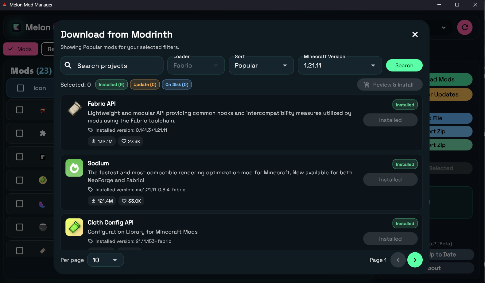

#  Melon Mod Manager

A desktop app to manage Minecraft mods, shaders, and resource packs in one place.

## App Preview



## What Does This App Do?

Melon Mod Manager makes it easy to:

- Browse and download mods, shaders, and resource packs directly from Modrinth
- Check for updates without manually visiting each project page
- Auto-detect your Minecraft installation and loader
- Drag and drop files into the app
- Manage installed mods, shaders, and resource packs from one UI
- Import and export packs for backup or sharing

## Compatible Devices

- Operating System: Windows 10/11 (64-bit), Linux (x64)
- Minecraft Loaders: Fabric, Quilt, Forge, NeoForge
- Internet Required: Yes, for Modrinth search and update checks

## What's New in 1.7.0-2026.03.30

- Added animated loading icons for update-related actions so fetching and checking states are easier to spot.
- Improved refresh progress details so Melon now shows the current category and the current Modrinth item being checked.
- Manual app checks and manual mod, shader, and resource-pack checks now update the Last Checked Time log even when auto update is off.
- Fixed the stable app version label so `1.7.0-2026.03.30` no longer shows a beta badge.
- Hardened the Modrinth browser states so empty or switching result views do not leave a blank panel behind.
- Removed leftover legacy helper code that was no longer used.

## Key Features

- Smart detection of Minecraft folders and loader type
- One-click update checks for managed content
- Modrinth integration with search and install flows
- Drag-and-drop support for local `.jar` and `.zip` files
- Mod pack import and export support
- Support for content from outside Modrinth
- Exportable error logs for troubleshooting

## About This Project

This is a personal open-source project built to make Minecraft mod management simpler and safer.

### Antivirus Note

Some antivirus tools may flag this app because it is a new or unsigned Windows application. This is a common false positive for small desktop apps.

You can verify the app by:

- Reviewing the source code in this repository
- Building it yourself from source
- Comparing downloaded files against the included SHA256 checksums

## Quick Start

1. Download the latest release from the [Releases page](https://github.com/xyrusL/melon_mod_manager/releases)
2. Windows: run `MelonModManager-Win64-Setup-<version>.exe` or extract the portable zip
3. Linux: extract `MelonModManager-Linux-Setup-<version>.tar.gz` and run `melon_mod_manager`
4. Launch Melon Mod Manager
5. Select your Minecraft folder
6. Start browsing and installing content

## For Developers

```bash
flutter pub get
flutter run -d windows
flutter run -d linux
flutter test
flutter analyze
```

## Important Notes

- Only content linked to Modrinth can be updated automatically
- Manually added content will still appear in the app but may not support auto-update
- Back up important saves before changing your mod setup

## Links

- Repository: https://github.com/xyrusL/melon_mod_manager
- Issues: https://github.com/xyrusL/melon_mod_manager/issues
- Modrinth: https://modrinth.com

## License

GNU GPL v3.0 License. See the [LICENSE](LICENSE) file for details.

Made for the Minecraft community
