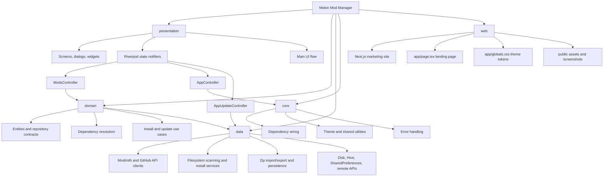
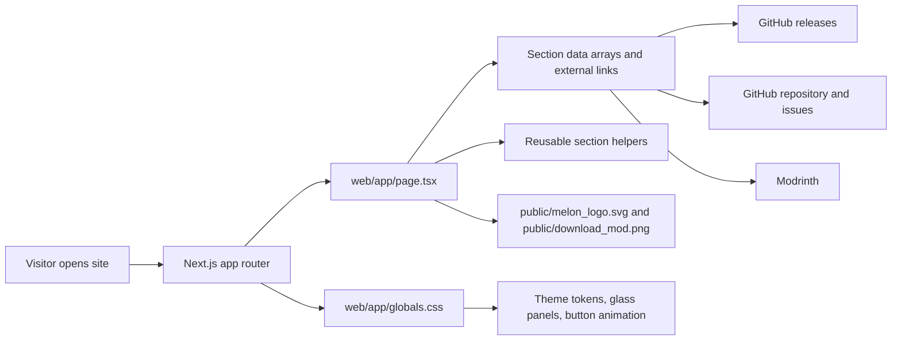

# Architecture

## Visual Outline

## Overview

Melon Mod Manager is a desktop Flutter app with a fairly strict split between:

- `presentation`: screens, dialogs, widgets, and Riverpod state notifiers
- `domain`: app-facing entities, repository contracts, dependency/update/install use cases
- `data`: concrete implementations for Modrinth/GitHub APIs, filesystem scanning, zip import/export, and persistence
- `core`: dependency wiring, theme, shared error handling, and small utilities
- `web`: a separate Next.js website used for download, repository, issue, and Modrinth entry points

The app is not event-bus driven. Most user actions go through a small number of Riverpod `StateNotifier`s:

- `AppController` decides whether the app is in setup or ready state.
- `ModsController` is the main coordinator for scanning, installing, importing/exporting, deleting, and update checks.
- `AppUpdateController` handles app release checks against GitHub.

Heavy work is intentionally pushed out of widgets and into services/use cases. `ModsController` is the main orchestration layer, not the place where archive parsing or download logic actually lives.

## Main Folders

### `lib/main.dart`

Desktop bootstrap:

- initializes Flutter, window sizing, Hive, and `SharedPreferences`
- installs fatal error hooks (`FlutterError`, platform dispatcher, zone)
- injects initialized dependencies into Riverpod via provider overrides

This is also where the app falls back to launching even if bootstrap partially fails, so the global fatal overlay can still render.

### `lib/app.dart`

App shell:

- builds `MaterialApp`
- switches between loading, setup, and main UI from `appControllerProvider`
- renders the global fatal error overlay from `AppErrorService`

The fatal overlay is intentionally separate from user-facing situation dialogs. Situation dialogs are for understandable environment/path problems; the overlay is for internal crashes.

### `lib/core`

Cross-cutting infrastructure:

- `providers.dart`: the central dependency graph
- `app_error_service.dart`: stores fatal/non-fatal error records and builds exportable logs
- `error_reporter.dart`: converts caught exceptions into user-facing messages
- `theme/`: custom app theme and modal/panel styling
- `safe_file_name.dart`: path/file-name validation used before writing imported/downloaded files

`providers.dart` is the best place to reorient yourself after a long break. It shows almost every major service, repository, use case, and async provider in one file.

### `lib/domain`

Application-level contracts and orchestration logic:

- `entities/`: `ModItem`, Modrinth entities, content types, update settings, app theme mode
- `repositories/`: interfaces for settings, Modrinth, and the local Modrinth mapping store
- `services/dependency_resolver_service.dart`: resolves required dependencies before install
- `usecases/install_mod_usecase.dart`: install entry point for a selected Modrinth project
- `usecases/install_queue_usecase.dart`: downloads/stages/commits resolved dependency installs
- `usecases/update_mods_usecase.dart`: Modrinth-backed update execution

The main design choice here is that dependency resolution and update execution live outside the UI/controller layer, while `ModsController` coordinates when to call them.

### `lib/data`

Concrete implementations and low-level IO:

- `services/modrinth_api_client.dart`: raw Modrinth HTTP calls
- `services/github_api_client.dart`: GitHub profile/release/repo calls
- `repositories/modrinth_repository_impl.dart`: wraps Modrinth API models into domain entities and verifies downloaded file hashes
- `repositories/settings_repository_impl.dart`: persists app settings via `SharedPreferences`
- `repositories/modrinth_mapping_repository_impl.dart`: persists local file-to-Modrinth metadata via Hive
- `services/minecraft_path_service.dart`: auto-detects Minecraft/mod-loader instance paths
- `services/minecraft_loader_service.dart` / `minecraft_version_service.dart`: detect loader/version from path and launcher metadata
- `services/mod_scanner_service.dart`: scans `.jar` files and extracts metadata/icon cache
- `services/content_scanner_service.dart`: scans resource pack/shader pack folders
- `services/file_install_service.dart`: copies user-selected local files into the target content folder
- `services/mod_pack_service.dart`: zip import/export for mods and content bundles
- `services/content_path_service.dart`: converts the base mods path into content-specific folders (`mods`, `resourcepacks`, `shaderpacks`)
- `services/content_icon_service.dart`: resolves thumbnails/icons for non-mod content

`mod_pack_service.dart` is the densest file in the repo. It owns most archive-related behavior, including Melon-specific manifests and mixed “embedded file + Modrinth reference” bundle imports.

### `lib/presentation`

UI and app state:

- `screens/setup_screen.dart`: first-run path selection and auto-detect
- `screens/main_screen.dart`: main workspace for browsing content and triggering actions
- `dialogs/modrinth_search_dialog.dart`: browse/search/install from Modrinth
- `dialogs/situation_dialog.dart`: user-facing environment/path problem dialogs
- `widgets/`: reusable UI pieces like the action panel, mod table, top bar, modal shell
- `viewmodels/`: Riverpod `StateNotifier`s (`app_controller.dart`, `mods_controller.dart`, `app_update_controller.dart`)

The presentation layer is thin in some places and thick in others. `main_screen.dart` is large because it coordinates many modal/action flows, but it still delegates actual work down into `ModsController` and the lower layers.

### `test`

Tests focus on code that matters operationally:

- path/loader/version detection
- release metadata/version labeling
- Modrinth repository/client behavior
- dependency resolution and updates
- modal/search dialog behaviors
- pack import security cases

This test layout is a good map of which parts of the codebase are considered risky.

### `web`

Marketing/download site for the desktop app:

- `app/page.tsx`: the landing page content, section structure, external links, and card styling
- `app/globals.css`: shared website theme tokens, backgrounds, motion, and utility classes
- `public/`: logo, favicon, and the product screenshot used on the landing page
- `package.json`: Next.js scripts for local dev and production builds

Use this folder when you need to update the public-facing website rather than the Flutter desktop UI. If someone is looking for website copy, layout, colors, or external download links, start in `web/app/page.tsx` and `web/app/globals.css`.

### Other Project Folders

- `.github/workflows/`: CI plus Windows/Linux release pipelines
- `tool/`: release metadata helper used by GitHub Actions
- `assets/`: app logo and screenshots
- `web/`: Next.js website for marketing, release downloads, and project links
- `windows/`: Windows runner and installer script

## Data Flow Through the App

## Website Flow

This flow is intentionally simple. The website is a static Next.js landing page, so most changes live in `web/app/page.tsx` for structure/copy and `web/app/globals.css` for look-and-feel.

## 1. App state bootstrap

1. `main.dart` initializes desktop/windowing and local storage.
2. `ProviderScope` injects initialized `SharedPreferences` and Hive box instances.
3. `MelonModApp` reads `appControllerProvider`.
4. `AppController` loads saved mods path + theme from `SettingsRepository`.
5. The app routes to:
   - `SetupScreen` if no saved path exists
   - `MainScreen` if a path exists

Important detail: a saved path does not guarantee the folder still exists. `MainScreen._initializeForPath()` revalidates the path and now shows a situation dialog if the folder is gone or moved.

## 2. General UI action flow

For most actions, the flow is:

1. Widget triggers an intent in `MainScreen` or a dialog.
2. Screen/dialog reads a notifier from Riverpod.
3. `ModsController` updates UI state (`isBusy`, `infoMessage`, `errorMessage`, selected content type).
4. `ModsController` calls a use case or service.
5. Results are written to disk / mappings / caches.
6. `ModsController` reloads the current content list and surfaces a summary back to UI.

The UI does not directly manipulate files or call Modrinth clients.

## Key Logic Locations

### State management

- `lib/presentation/viewmodels/app_controller.dart`
- `lib/presentation/viewmodels/mods_controller.dart`
- `lib/presentation/viewmodels/app_update_controller.dart`

### API calls

- `lib/data/services/modrinth_api_client.dart`
- `lib/data/services/github_api_client.dart`
- `lib/data/repositories/modrinth_repository_impl.dart`
- `lib/data/services/app_update_service.dart`

### File handling

- `lib/data/services/file_install_service.dart`: local file copy/install
- `lib/data/services/mod_scanner_service.dart`: jar scanning + metadata/icon cache
- `lib/data/services/content_scanner_service.dart`: resource pack/shader pack scanning
- `lib/data/services/mod_pack_service.dart`: zip import/export
- `lib/domain/usecases/install_queue_usecase.dart`: staged Modrinth downloads into final mod files

### Persistence

- `lib/data/repositories/settings_repository_impl.dart`: saved path/theme/update settings
- `lib/data/repositories/modrinth_mapping_repository_impl.dart`: local file -> Modrinth project/version mapping

The mapping repository is important. A lot of update/import behavior depends on knowing which local file corresponds to which Modrinth project/version.

## Important Flows

## App startup

### First run / no path

- `AppController` returns `AppStatus.setup`
- `SetupScreen` lets the user auto-detect or browse to a mods folder
- auto-detect uses `MinecraftPathService.detectDefaultModsPathDetailed()`
- save writes the chosen path to `SettingsRepository`
- `AppController.saveModsPath()` flips the app to `ready`

### Returning user

- `AppController` restores the saved path
- `MainScreen._initializeForPath()` validates the folder
- `ModsController.loadContent()` loads the current content type
- if the folder is missing, the app now shows a situation dialog instead of silently failing into generic errors

### Background startup work

After main content loads, `MainScreen` also:

- runs app/content auto-update checks if due
- warms metadata caches in the background
- invalidates and refreshes environment info providers when needed

## Installing mods

There are two install paths.

### A. Install from Modrinth

Entry points:

- `MainScreen._openModrinthSearch()`
- `ModrinthSearchDialog`
- `ModsController.installFromModrinth()`

Flow:

1. `ModrinthSearchDialog` detects current Minecraft version/loader from the selected path.
2. User chooses a project.
3. `ModsController.installFromModrinth()` calls `InstallModUsecase.installFromProject()`.
4. `InstallModUsecase` asks `DependencyResolverService` for:
   - the correct main version
   - required dependencies
   - blocking incompatibilities/unavailable required mods
5. If resolution succeeds, `InstallQueueUsecase.executeInstallQueue()`:
   - downloads each jar to a temp staging path
   - verifies hashes through `ModrinthRepositoryImpl`
   - commits files into the mods folder with backup/rollback behavior
   - removes stale mapped files for the same project
   - stores/update local `ModrinthMapping` entries in Hive
6. `ModsController` reloads content and shows a summary

Non-obvious detail: actual “install” is staged and then committed, not streamed directly into the final mods folder. That reduces the chance of corrupting an existing file on partial failure.

### B. Install local files

Entry points:

- `MainScreen._addFiles()`
- drag-and-drop in `MainScreen`
- `ModsController.installExternalFiles()`

Flow:

1. UI resolves the target content folder through `ContentPathService`.
2. `FileInstallService.installFiles()` copies the selected files into that folder.
3. Conflict handling is delegated back to the UI via `ConfirmOverwriteDialog`.
4. Any existing Modrinth mapping for the installed filename is removed.
5. Content is reloaded.
6. Background mapping resolution may try to reconnect external files to Modrinth metadata later.

This path is intentionally simpler than Modrinth installs: it is copy-based, not dependency-aware.

## Import / export process

### Export

Entry points:

- `ModsController.exportModsToZip()`
- `ModsController.exportContentToZip()`

Behavior:

- Mods export uses `ModPackService.exportModsToZip()`
  - writes actual `.jar` files into the archive
  - includes `melon_mod_pack.json`
- Resource packs / shaders export uses `ModPackService.exportContentBundleToZip()`
  - can store either embedded files or Modrinth references
  - writes `melon_content_bundle.json`

The content bundle format is more advanced than the mod export format. It can describe files by Modrinth reference instead of always embedding the payload.

### Import

Entry points:

- `ModsController.importModsFromZip()`
- `ModsController.importContentFromZip()`

Behavior:

- Mods import:
  - scans zip entries
  - compares incoming jars to currently installed mods using parsed metadata and hashes
  - decides install/update/rename/skip
  - removes stale mappings for touched files
- Content import:
  - first tries Melon bundle import (`importContentBundleFromZip`)
  - if there is no bundle manifest, falls back to plain zip import
  - if the bundle contains Modrinth references, it downloads those versions during import
  - touched local mappings are cleared/replaced

Non-obvious detail: content imports have a two-level fallback:

1. Melon bundle manifest path
2. plain archive import path

Mods imports also treat “Melon-generated pack” and “generic zip containing jars” as compatible inputs.

## Non-obvious Design Decisions

- The saved “mods path” is the base anchor for the whole app. `ContentPathService` derives `resourcepacks` and `shaderpacks` from it instead of storing separate root paths.
- `ModsController` caches loaded content per `(normalized path, content type)` in memory. Many UI refreshes reuse this cache unless `forceRefresh` is requested.
- Modrinth update/install behavior depends heavily on the Hive-backed mapping store. External files without mappings are intentionally treated as “not from Modrinth” until matched again.
- Environment detection is best-effort. If loader/version cannot be detected, the app still allows some actions but now warns the user with situation dialogs instead of generic errors.
- `mod_pack_service.dart` mixes three responsibilities in one place: archive IO, Melon manifest formats, and import conflict/version decisions. It is central to the import/export story even though the UI only calls a few controller methods.
- The app supports a “soft-fail” startup philosophy: bootstrap failures route into the app shell with the fatal overlay instead of crashing before UI appears.

## Where To Start After a Long Break

If you need to reorient quickly:

1. Read `lib/core/providers.dart` to rebuild the dependency graph.
2. Read `lib/presentation/viewmodels/mods_controller.dart` to see what the UI can do.
3. Read these data/domain files next depending on the feature:
   - install/update: `install_mod_usecase.dart`, `install_queue_usecase.dart`, `update_mods_usecase.dart`
   - import/export: `mod_pack_service.dart`
   - Minecraft path/environment detection: `minecraft_path_service.dart`, `minecraft_loader_service.dart`, `minecraft_version_service.dart`
   - remote API behavior: `modrinth_repository_impl.dart`, `modrinth_api_client.dart`, `app_update_service.dart`

